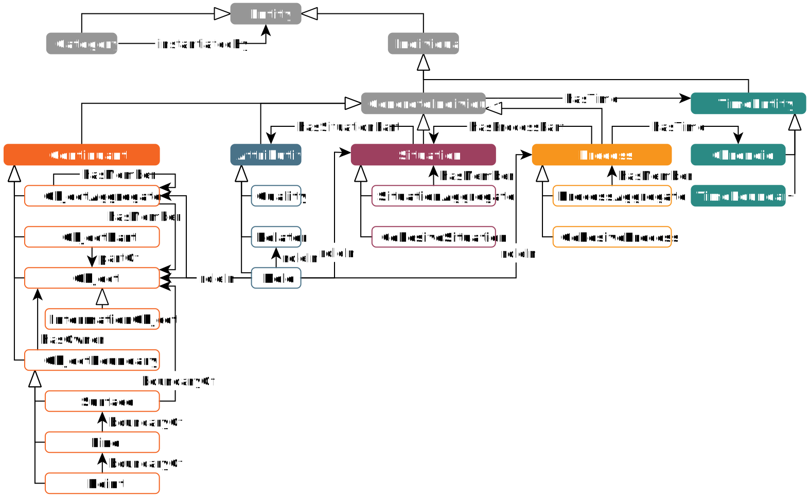

# General Formal Ontology (light version)

 

## Introduction

GFO-light contains some simplifications compared to the full version of General Formal Ontology (GFO, [Loebe, F. et al. (2022). GFO: The General Formal Ontology.](https://doi.org/10.3233/AO-220264)) and is designed as a framework for the efficient development and foundation of domain/application ontologies.
This guide describes the structure and a possible use of this lightweight top-level ontology in domain-specific projects, also for users who are not familiar with the basics of formal ontologies.
GFO-light is primarily concerned with categories of concrete individuals (*Continuant*, *Attributive*, *Process* and *Situation*), i.e., entities that have an immediate relation to time (*TimeEntity*) or to space-time.

⚠ GFO-light extends GFO-core (i.e., adopts all GFO-core axioms), which contains the core GFO entities and serves as a common basis for both GFO variants (light and full).
For some use cases, it may be sufficient to use GFO-core alone as a kind of minimal top-level ontology.

⚠ When developing a domain-specific ontology using GFO-light, please create your classes as subclasses of *Continuant*, *Attributive*, *Process*, *Situation* and *TimeEntity* (or their subclasses, the more specific the better).
You can also create the desired object or data properties (if possible as subproperties of GFO-core or GFO-light properties).

**Fig. 1. GFO-light overview** (The figure shows all categories and selected relations. The GFO-core categories are displayed as filled boxes.)

## How to Use

You just need to import this ontology into your domain-specific ontology via the IRI https://w3id.org/gfo-light.
For each [release](https://github.com/Onto-Med/gfo-light/releases) of this ontology, a version IRI is available with the format `https://w3id.org/gfo-light/release/<VERSION>`.
In addition, the version IRI <https://w3id.org/gfo-light/release/latest> always represents the latest version.

When developing a domain-specific ontology using GFO-light, please create your classes as subclasses of *Continuant*, *Attributive*, *ProcessualEntity*, *SituationalEntity* and *TimeEntity* (or their subclasses, the more specific the better).
You can also create the desired object or data properties (if possible as subproperties of GFO-light properties).

For more information, see the [ontology documentation](https://onto-med.github.io/gfo-light/latest/) and our [user guide](docs/README.md).

Individual IRIs of GFO-light classes and properties (e.g., https://w3id.org/gfo-light/Category) are pointing to the RDF browser [RickView](https://github.com/KonradHoeffner/rickview).

## Examples

Here is a selection of ontologies we maintain that are founded in GFO-light and can serve as a starting point for working with GFO-light.

| Ontology                                 | Repository                             | IRI                             |
| ---------------------------------------- | -------------------------------------- | ------------------------------- |
| Anthropological Notation Ontology (ANNO) | https://github.com/annosaxfdm/ontology | https://annosaxfdm.de/ontology/ |
| Risk Identification Ontology (RIO)       | https://github.com/Onto-Med/RIO        | https://w3id.org/rio/           |
| Core Ontology of Phenotyping (COP)       | https://github.com/Onto-Med/COP        | https://w3id.org/cop/           |

Additional [examples](examples) are available.

## How to Contribute

Please see our [contributing guide](CONTRIBUTING.md).

## See Also

- [General Formal Ontology](https://github.com/Onto-Med/GFO)
- [Top-level ontology](http://en.wikipedia.org/wiki/Upper_ontology_%28computer_science%29)
