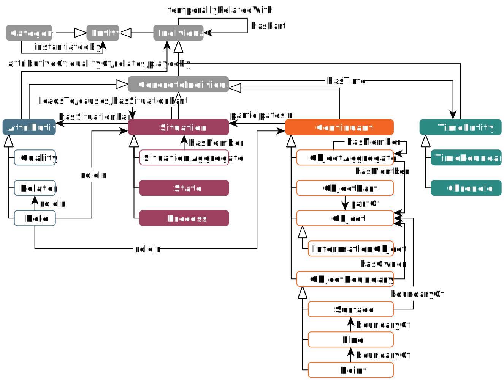
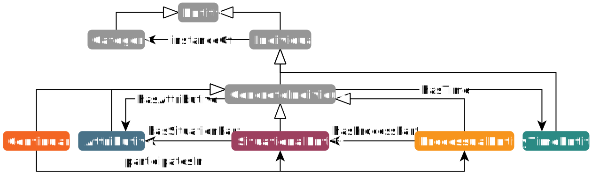
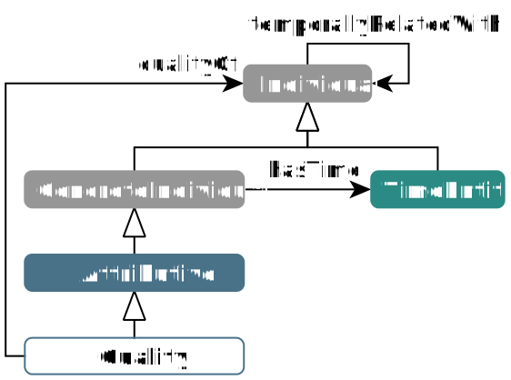
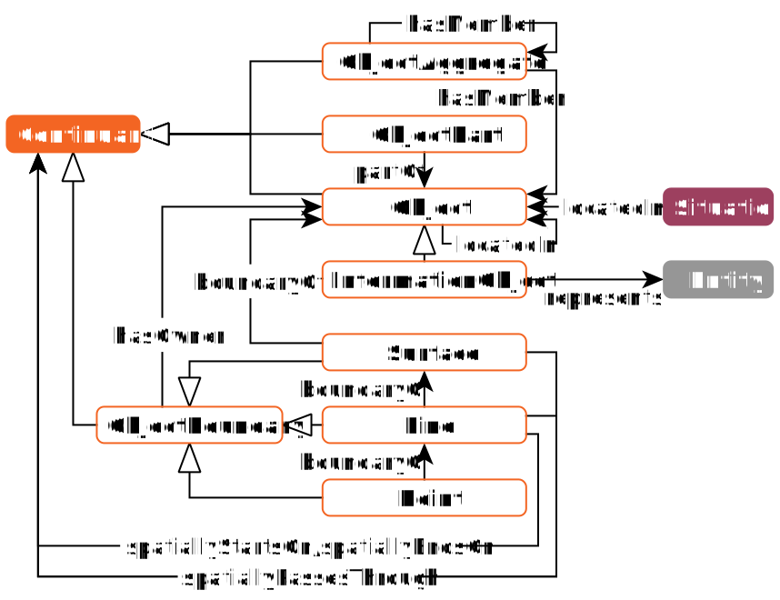
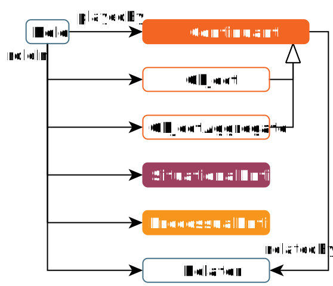
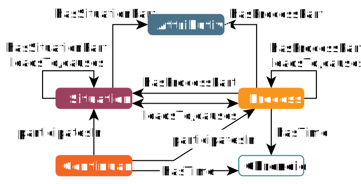

# GFO-light: General Formal Ontology (light version)

GFO-light contains some simplifications compared to the full version of General Formal Ontology (GFO, [Loebe, F. et al. (2022). GFO: The General Formal Ontology.](https://doi.org/10.3233/AO-220264)) and is designed as a framework for the efficient development and foundation of domain/application ontologies. This guide describes the structure and a possible use of this lightweight top-level ontology in domain-specific projects, also for users who are not familiar with the basics of formal ontologies. GFO-light is primarily concerned with categories of concrete individuals ([Continuant](#continuant), [Processual Entity](#processual-entity), [Attributive](#attributive) and [Situational Entity](#situational-entity)), i.e., entities that have an immediate relation to time ([Time Entity](#time-entity)) or to space-time.

⚠ When developing a domain-specific ontology using GFO-light, please create your classes as subclasses of *Continuant*, *Attributive*, *ProcessualEntity*, *SituationalEntity* and *TimeEntity* (or their subclasses, the more specific the better). You can also create the desired object or data properties (if possible as subproperties of GFO-light properties).

## Overview

### Core Level

The core level of GFO-light contains the core GFO entities and serves as an interface to GFO (full), i.e., it forms a common basis for both GFO versions. For some use cases, it may be sufficient to use only the core level as a kind of minimal top-level ontology.

### Detailed Module Views

<table width="100%">
    <tr><td width="60%"></td><td><b>Individual</b>  Individuals are quality bearers (<i>hasQuality</i>, <i>qualityOf</i>, see <a href="#user-content-attributive">Attributive</a>) and can be temporally related to other individuals (subproperties of <i>temporallyRelatedWith</i>, see <a href="#user-content-time-entity">Time Entity</a>). Concrete individuals are related to time (<i>hasTime</i>, see <a href="#user-content-time-entity">Time Entity</a>).</td></tr>
    <tr><td width="60%"></td><td><b>Continuant</b>  Object parts can be specified using the object properties <i>hasPart</i> or <i>partOf</i>. To model the membership of a member in a group/aggregate, the object properties <i>hasMember</i>/<i>memberOf</i> should be used. Objects can be located in other objects (<i>locatedIn</i>). Boundaries of objects are surfaces, boundaries of surfaces are lines and boundaries of lines are points. Lines can pass through (<i>spatiallyPassesThrough</i>, <i>spatiallyStartsOn</i>, <i>spatiallyEndsOn</i>) various points. Object boundaries can be assigned to the corresponding object using the object property <i>hasOwner</i>. (see <a href="#user-content-continuant">Continuant</a>)</td></tr>
    <tr><td width="60%"></td><td><b>Role</b>  A role is a relational entity that links a continuant (role player) with some context (continuant, processual entity, situational entity, relator), in which the continuant plays that role. Roles are assigned to the corresponding context entity using object properties <i>roleIn</i> or <i>containsRole</i>. The role players are associated with the roles they play using object properties <i>plays</i> or <i>playedBy</i>. Continuants participate in processual and situational entities (<i>participatesIn</i>, <i>hasParticipant</i>) and are related by relators (<i>relatedBy</i>, <i>relates</i>) in which they play relational roles. (see <a href="#user-content-attributive">Attributive</a>)</td></tr>
    <tr><td width="60%"></td><td><b>Situation/Process</b>  Situations represent static knowledge, while processes represent dynamic knowledge. Continuants can participate in situations and processes (<i>participatesIn</i>, <i>hasParticipant</i>). Situations can have attributives and further situations as parts (<i>hasSituationPart</i>, <i>situationPartOf</i>). Processes can have attributives, situations and further processes as parts (<i>hasProcessPart</i>, <i>processPartOf</i>). Processes and situations can lead to (<i>leadsTo</i>, <i>resultsFrom</i>) or cause (<i>causes</i>, <i>causedBy</i>) further processes and situations. (see <a href="#user-content-situational-entity">Situational Entity</a>, <a href="#user-content-processual-entity">Processual Entity</a>)</td></tr>
</table>

## Continuant

Social or material (three-dimensional) objects, their groups/aggregates and parts as well as their boundaries (two-, one- and zero-dimensional entities, i.e., surfaces, lines and points) are subsumed under the category *Continuant*. Continuants are concrete individuals that persist through time and are wholly present at every point of their existence time (lifetime). 

**Objects** are social or material continuants that can exist independently of other continuants (e.g., a person, a computer, a chopstick or a football stadium). **Tokens** are specific objects that instantiate a symbolic structure. These are not only texts, but generally representations or specifications, such as a UML model or a computer programme.

**Object aggregates** are groups of objects that together form a unit (e.g., a research group at a university or a sports team).

**Object parts** are continuants that cannot exist independently of the whole object of which they are parts. (e.g., part of a bone or of a chopstick).

<table>
    <tr><th>Domain class</th><th>GFO-light superclass</th><th>Restriction</th></tr>
    <tr><td>Team</td><td>ObjectAggregate</td><td><i>hasMember some Player</i></td></tr>
    <tr><td>Player</td><td>Object</td><td><i>memberOf exactly 1 Team</i></td></tr>
    <tr><td>Stadium</td><td>Object</td><td></td></tr>
    <tr><td>FootballFieldSurface</td><td>Surface</td><td><i>hasOwner exactly 1 Stadium</i></td></tr>
    <tr><td>FootballFieldBoundaryLine</td><td>Line</td><td><i>boundaryOf exactly 1 FootballFieldSurface</i></td></tr>
</table>

**Example 1a.** *Continuant classes.*

Usually, connected objects are considered as single objects, i.e., the object parts are firmly connected to the whole object, while loose objects can form a group/aggregate. When modelling a person, for example, you could consider their skeleton as a (connected) object and as part of the human body. However, if we look at bone finds in the context of anthropology, the skeleton can be modelled as an aggregate of individual bones.

The object parts can be specified using the object properties *hasPart* or *partOf*. To model the membership of a member in a group/aggregate, the object properties *hasMember*/*memberOf* should be used (Example 1b, playerA1). Objects can be located in other objects (*locatedIn*, e.g., the driver is located in the car).

**Object boundaries** are 0-, 1-, or 2-dimensional (visible or imaginary) entities (i.e., points, lines and surfaces) that border objects (natural boundaries) or are located inside them (inner boundaries). In the anthropology use case, for example, these can be certain planes (e.g., frontal plane), axes (e.g., longitudinal axis) and points (e.g., gonion) of the human skeleton. Other examples are the surface and the boundary lines of the football field or the penalty spot. Boundaries of objects are surfaces, boundaries of surfaces are lines and boundaries of lines are points. Such relationships are specified using object properties *boundaryOf*, *innerBoundaryOf* or *naturalBoundaryOf*. Lines are not necessarily straight. They can be, for example, curves or broken lines that pass through (*spatiallyPassesThrough*, *spatiallyStartsOn*, *spatiallyEndsOn*) various points and form a corner, a triangle or a polygon. Object boundaries can be assigned to a corresponding object using the object property *hasOwner*. 

<table>
    <tr><th>Instance</th><th>Type</th><th>Assertion</th></tr>
    <tr><td>teamA</td><td>Team</td><td><i>participatesIn matchX</i></td></tr>
    <tr><td>playerA1</td><td>Player</td><td><i>memberOf teamA 
											   participatesIn aGoal1 
											   participatesIn aGoal2</i></td></tr>
    <tr><td>RedBullArenaLeipzig</td><td>Stadium</td><td></td></tr>
    <tr><td>fieldOfRbArena</td><td>FootballFieldSurface</td><td><i>hasOwner RedBullArenaLeipzig</i></td></tr>
    <tr><td>sectorAFieldBoundary</td><td>FootballFieldBoundaryLine</td><td><i>boundaryOf fieldOfRbArena</i></td></tr>
</table>

**Example 1b.** *Continuant instances.*

⚠ In contrast to GFO (full) (see [Loebe, F. et al. (2022). GFO: The General Formal Ontology.](https://doi.org/10.3233/AO-220264)), GFO-light does not support presentic objects (presentials) but only temporally extended objects (continuats). However, GFO-light enables you to define the validity/existence time of attributives of the objects and situations in which they participate, either as a time interval or as a point in time.

⚠ GFO (full) includes a sophisticated space module based on the dual nature of space (phenomenal vs. extensional space) and distinguishes between boundaries of material objects and boundaries of spatial regions (see [Baumann, R. et al. (2016). Towards an Ontology of Space for GFO.](https://doi.org/10.3233/978-1-61499-660-6-53), [Loebe, F. et al. (2021). Developing GFO 2.0 Further – Initiating the Modules of Space and Material Objects.](https://ceur-ws.org/Vol-2969/paper69-FOUST.pdf)). For simplicity, GFO-light only considers boundaries of material objects.

## Processual Entity

Processual entities include processes and process aggregates.

Processes are concrete individuals that happen in time and have a temporal extension (chronoid/time interval). Processes represent dynamic knowledge. A football match, a treatment of a patient in a hospital or the course of an illness are examples of processes.  

<table>
    <tr><th>Domain class</th><th>GFO-light superclass</th><th>Restriction</th></tr>
    <tr><td>Match</td><td>Process</td><td><i>locatedIn exactly 1 Stadium 
											 hasProcessPart exactly 1 FirstHalf 
											 hasProcessPart exactly 1 SecondHalf 
											 hasParticipant exactly 2 Team 
											 temporallyStartedBy exactly 1 StartOfMatch 
											 temporallyFinishedBy exactly 1 EndOfMatch</i></td></tr>
    <tr><td>FirstHalf</td><td>Process</td><td><i>processPartOf exactly 1 Match 
												 temporallyStartedBy exactly 1 StartOfMatch 
												 temporallyFinishedBy exactly 1 EndOfFirstHalf</i></td></tr>
    <tr><td>SecondHalf</td><td>Process</td><td><i>processPartOf exactly 1 Match 
												  temporallyStartedBy exactly 1 StartOfSecondHalf 
												  temporallyFinishedBy exactly 1 EndOfMatch</i></td></tr>
</table>

**Example 2a.** *Process classes.*

Processes can have parts (*hasProcessPart*, *processPartOf*), which are situations, attributives or further processes, e.g., the first half and the goal situations are parts of the match. Continuants can participate in processes (*participatesIn*, *hasParticipant*), e.g., the teams A and B participate in the football match (Example 1b, teamA). Processes can take place (*locatedIn*) in objects (e.g., a football match in a stadium or an illness in a person). Processes can lead to (*leadsTo*, *resultsFrom*) or cause (*causes*, *causedBy*) further processes and situations.

<table>
    <tr><th>Instance</th><th>Type</th><th>Assertion</th></tr>
    <tr><td>matchX</td><td>Match</td><td><i>locatedIn RedBullArenaLeipzig 
    					 				    temporallyStartedBy startOfMatch 
											temporallyFinishedBy endOfMatch 
      										numberOfSpectators “40000”^^xsd:int</i></td></tr>
    <tr><td>half1</td><td>FirstHalf</td><td><i>processPartOf matchX 
											   temporallyStartedBy startOfMatch 
											   temporallyFinishedBy endOfFirstHalf</i></td></tr>
</table>

**Example 2b.** *Process instances.*

Process aggregates are sets (*hasMember*) of processes that are contextually related but not temporally connected (e.g., a series of lectures in a semester or all football matches in a league season).

## Attributive

Qualities (attributes, traits, characteristics, etc.) of concrete individuals, relations (relators) between them and roles that objects can play in different contexts are subsumed under the category *Attributive*. Attributives are individuals that depend on other individuals by some kind of dependency relation.

### Quality

Qualities are attributives that typically inhere in its bearer and can possess values. Examples are observable or measurable characteristics of single objects, e.g., persons, (such as weight and height, laboratory parameters or symptoms), qualities of object groups (e.g., goals scored by a football team in a match) or of processes (e.g., the number of spectators as quality of a football match). The qualities can be defined in two ways. If they have a value (representable as a number, string, date, etc.), do not require the specification of existence time and are no parts of situations, domain-specific data properties can simply be defined as subproperties of *decimalValue* (e.g., *numberOfSpectators*), *stringValue*, *dateTimeValue*, etc. These domain-specific properties can then be used in data property assertions for a direct assignment of the value to the corresponding bearer (Example 2b, matchX). In all other cases, a separate domain-specific class (e.g., *PlayerGoals*) must be created as a subclass of *Quality* and its instances can be assigned to the bearers using the object properties *qualityOf* or *hasQuality*. In this case, the existence time can be specified for the quality instances (Example 3b, a1GoalsEndOfFirstHalf, a1GoalsEndOfMatch).

<table>
    <tr><th>Domain class</th><th>GFO-light superclass</th><th>Restriction</th></tr>
    <tr><td>PlayerQuality 
			→ Assists 
			→ PlayerGoals</td><td>Quality</td><td><i>qualityOf exactly 1 Player 
													 processPartOf exactly 1 Match</i></td></tr>
    <tr><td>TeamQuality 
			→ BallPossession 
			→ TeamGoals</td><td>Quality</td><td><i>qualityOf exactly 1 Team 
												   processPartOf exactly 1 Match</i></td></tr>
    <tr><td>WinnerLoserRelator</td><td>Relator</td><td><i>containsRole exactly 1 WinnerRole 
														  containsRole exactly 1 LoserRole 
														  processPartOf exactly 1 Match</i></td></tr>
    <tr><td>PlayerRoleInTeam 
			→ Defender 
			→ Forward 
			→ Midfielder</td><td>RoleInContinuant</td><td><i>roleIn exactly 1 Team 
															   playedBy exactly 1 Player 
															   processPartOf exactly 1 Match</i></td></tr>
    <tr><td>TeamRoleInMatch 
			→ HomeTeamRole 
			→ VisitingTeamRole</td><td>ProcessualRole</td><td><i>roleIn exactly 1 Match 
																 playedBy exactly 1 Team 
																 processPartOf exactly 1 Match</i></td></tr>
    <tr><td>PlayerRoleInGoal 
			→ AssistantRole 
			→ ScorerRole</td><td>SituationalRole</td><td><i>roleIn exactly 1 Goal 
															playedBy exactly 1 Player 
															situationPartOf exactly 1 Goal 
															processPartOf exactly 1 Match</i></td></tr>
    <tr><td>TeamRoleInWinnerLoserRelator 
			→ WinnerRole 
			→ LoserRole</td><td>RelationalRole</td><td><i>roleIn exactly 1 WinnerLoserRelator 
														  playedBy exactly 1 Team 
														  processPartOf exactly 1 Match</i></td></tr>
</table>

**Example 3a.** *Attributive classes.*

### Role

A role is a relational entity that links a continuant (role player) with some context, in which the continuant plays that role. We distinguish between continuant part/member roles (*RoleInContinuant*), processual roles, situational roles and relational roles. A **role in continuant** is the role that a continuant part or member plays in the corresponding superordinate continuant (e.g., the processor is part of the computer and has the task/function/role to process commands or John is member of the football team and plays the role of midfielder, Example 3b, a2RoleImTeam). A **processual role** is the role that a participant plays in a process (e.g., team A plays the home team role and team B plays the visiting team role in a football match, Example 3b, teamARole). A **situational role** is the role that a participant plays in a situation (e.g., scorer and assistant role in a goal situation or roles played by a doctor and a patient in a risk/adverse situation in hospital). A **relational role** is the role that an entity plays in a relation (relator, see the next paragraph). Roles are assigned to the corresponding **context entity** (continuant, process, situation, relator) using object properties *roleIn* or *containsRole*. The role players are associated with the roles they play using object properties *plays* or *playedBy*.

<table>
    <tr><th>Instance</th><th>Type</th><th>Assertion</th></tr>
    <tr><td>a1GoalsEndOfFirstHalf</td><td>PlayerGoals</td><td><i>qualityOf playerA1 
																 processPartOf matchX 
																 decimalValue 1 
																 startedByDateTimeValue “2020-05-05T21:20:00”^^xsd:dateTime 
																 finishedByDateTimeValue “2020-05-05T22:30:00”^^xsd:dateTime</i></td></tr>
    <tr><td>a1GoalsEndOfMatch</td><td>PlayerGoals</td><td><i>qualityOf playerA1 
															 processPartOf matchX 
															 decimalValue 2 
															 startedByDateTimeValue “2020-05-05T22:30:00”^^xsd:dateTime</i></td></tr>
    <tr><td>a2RoleInTeam</td><td>Midfielder</td><td><i>roleIn teamA 
													   playedBy playerA2 
													   processPartOf matchX 
													   finishedByDateTimeValue “2020-05-05T22:40:00”^^xsd:dateTime</i></td></tr>
    <tr><td>teamARole</td><td>HomeTeamRole</td><td><i>roleIn matchX 
													  playedBy teamA</i></td></tr>
    <tr><td>winnerLoserRelatorEndOfMatch</td><td>WinnerLoserRelator</td><td><i>hasTime endOfMatch 
																			   processPartOf matchX</i></td></tr>
    <tr><td>aWinnerRole</td><td>WinnerRole</td><td><i>roleIn winnerLoserRelatorEndOfMatch 
													  playedBy teamA</i></td></tr>
</table>

**Example 3b.** *Attributive instances. a1GoalsEndOfFirstHalf represents the number of goals of playerA1 in the time period between his first and second goal. a1GoalsEndOfMatch is the number of goals of playerA1 after the second goal. a2RoleImTeam is a midfielder (continuant part) role in teamA that is played by playerA2 (this role has an end time due to substitution). teamARole is the home team (processual) role in matchX that is played by teamA. aWinnerRole is the winner (relational) role in winnerLoserRelatorEndOfMatch that is also played by teamA.*

⚠ GFO-light uses a simplified role model compared to GFO (full). In GFO (full) there are three types of roles (see [Loebe, F. et al. (2022). GFO: The General Formal Ontology.](https://doi.org/10.3233/AO-220264), [Loebe, F. (2007). Abstract vs. social roles: Towards a general theoretical account of roles.](https://doi.org/10.3233/APO-2007-031)): relational role as sibling of quality and subclass of attributive, processual role as subclass of process, and social role as social/socio continuant. However, all 4 GFO-light role types are considered as subclasses of role, and role as a subclass of attributive. *RoleInContinuant* can be used to describe both the parts of an object and the members (e.g., social roles) of an object aggregate. 

### Relator

Relators are attributives that connect other entities (role players) by relational roles (played by role players), i.e., represent individual relation instances. For example, a relator could be defined that describes the relative location of an object (playing the target object role) in relation to another object (playing the reference object role), e.g., the location of a person relative to the city centre or the location of an anatomical structure relative to the longitudinal axis. Such relators can be further classified, e.g., according to direction (in anthropology/anatomy, e.g., dorsal, ventral or lateral). Other examples are the marriage (relator) of John and Mary (in which Mary plays the wife role and John the husband role) or the winner-loser relator (Example 3b, winnerLoserRelatorEndOfMatch, aWinnerRole).

Similar to qualities, relations can also be represented by simple object properties (such as *hasPart*). However, if the existence time of the relation is relevant or it (or its roles) are parts of some situations, a relator (e.g., with a part and a whole role) should be used instead. An existence time can be defined both for relators themselves and for the individual roles (Example 3b, winnerLoserRelatorEndOfMatch, a2RoleImTeam). 

If the individual roles (regardless of the type, i.e., continuant part roles, processual roles, situational roles or relational roles) do not have an existence time to be defined and are no parts of situations or processes, they can likewise be represented by object properties. The relative position relator (see above) can, for example, be linked directly to the corresponding objects using the object properties *hasTargetObject* and *hasReferenceObject*. Similarly, football players can be assigned directly to a team using the properties *forwardOf*, *defenderOf*, etc. It also works with processual roles, the two playing teams can be associated to the football match by properties *homeTeamOf* and *visitingTeamOf*.

## Situational Entity

Situational entities include situations and situation aggregates.

Situations are combinations/constellations of attributives that belong together in the context of the use case under consideration. Situations represent static knowledge. A situation can exist at a certain point in time or during a certain period of time and can be part or result of a process or another situation (e.g., a goal situation as a result of an attack in a football match). Situations can lead to (*leadsTo*, *resultsFrom*) or cause (*causes*, *causedBy*) further situations and processes.

<table>
    <tr><th>Domain class</th><th>GFO-light superclass</th><th>Restriction</th></tr>
    <tr><td>MatchSituation</td><td>Situation</td><td><i>hasSituationPart some (MatchSituation or PlayerQuality or PlayerRoleInTeam or TeamQuality or TeamRoleInMatch or TeamRoleInWinnerLoserRelator or WinnerLoserRelator) 
														processPartOf exactly 1 Match</i></td></tr>
</table>

**Example 4a.** *Situation class.*

At the end of a football match (process), for example, a situation may arise in which one team has scored two goals and the other team one (the number of goals is a team's quality). A winner-loser relator can also be seen as part of this situation, with one team playing the winner role and the other team playing the loser role. Another example is a risk situation when treating a patient in hospital if his laboratory values (qualities) are in the critical range over a certain period of time. The desired attributives can be assigned to a situation using object properties *situationPartOf* or *hasSituationPart*. Continuants can participate in situations (*participatesIn*, *hasParticipant*), e.g., the player A1 participates in a goal situation or the teams participate in the situation at the end of the match.

<table>
    <tr><th>Instance</th><th>Type</th><th>Assertion</th></tr>
    <tr><td>situationEndOfMatch</td><td>MatchSituation</td><td><i>hasSituationPart winnerLoserRelatorEndOfMatch 
																  hasSituationPart aGoalsEndOfMatch 
																  hasSituationPart aBallPossessionEndOfMatch 
																  hasSituationPart teamARole 
																  hasSituationPart teamBRole 
																  hasSituationPart a1GoalsEndOfMatch 
																  hasSituationPart a2AssistsEndOfMatch 
																  hasSituationPart a1RoleImTeam 
																  hasSituationPart a22RoleImTeam 
																  hasSituationPart a33RoleImTeam 
																  hasTime endOfMatch 
																  processPartOf matchX</i></td></tr>
</table>

**Example 4b.** *Situation instance. The situation at the end of the match contains all relevant attributives: winner-loser relator, teams’ qualities (aGoalsEndOfMatch, aBallPossessionEndOfMatch), teams’ processual roles in match (teamARole, teamBRole), players’ qualities (a1GoalsEndOfMatch, a2AssistsEndOfMatch), players’ continuant part roles in team (a1RoleImTeam, a22RoleImTeam, a33RoleImTeam).*

Situation aggregates are sets (*hasMember*) of situations that are contextually related but not temporally connected (e.g., all phases of increased temperature in the course of an illness).

⚠ In GFO (full), both static and dynamic situations (object situations, presentic situations and situoids) are considered (see [Loebe, F. et al. (2022). GFO: The General Formal Ontology.](https://doi.org/10.3233/AO-220264), [Burek, P. et al. (2024). Ontologically Founded Design Patterns for Situation Modeling.](https://doi.org/10.62036/ISD.2024.85)). GFO-light does not distinguish between different situation types. To make it easier for domain experts to choose an appropriate GFO-light category for a specific use case, it is recommended to use situations for modelling static knowledge and processes for modelling dynamic knowledge.

## Time Entity

The time entities defined in GFO-light are points in time (time boundaries) and time intervals/periods (chronoids), which consist of points in time. 

<table>
    <tr><th>Domain class</th><th>GFO-light superclass</th><th>Restriction</th></tr>
    <tr><td>StartOfMatch</td><td>TimeBoundary</td><td><i>temporallyStarts exactly 1 FirstHalf 
    													 temporallyStarts exactly 1 Match</i></td></tr>
    <tr><td>EndOfFirstHalf</td><td>TimeBoundary</td><td><i>temporallyFinishes exactly 1 FirstHalf</i></td></tr>
    <tr><td>StartOfSecondHalf</td><td>TimeBoundary</td><td><i>temporallyStarts exactly 1 SecondHalf</i></td></tr>
    <tr><td>EndOfMatch</td><td>TimeBoundary</td><td><i>temporallyFinishes exactly 1 SecondHalf 
													   temporallyFinishes exactly 1 Match</i></td></tr>
</table>

**Example 5a.** *Time classes.*

Concrete individuals have an existence time (time boundary/point in time or chronoid/time interval). There are two ways for assigning a timestamp or a time interval/period to concrete individuals in a domain-specific ontology. The simplest option is to use the data property *dateTimeValue* (or its specific subproperties, e.g., *startedByDateTimeValue*/*finishedByDateTimeValue*) in the data property assertion (e.g., Example 3b a1GoalsEndOfFirstHalf/a1GoalsEndOfMatch/a2RoleImTeam). However, if a timestamp or time interval is to be defined once and reused several times for different individuals, instances of the classes *TimeBoundary* or *Chronoid* must be created, data property assertions based on the aforementioned data properties must be defined for them (Example 5b) and the instances must then be used in the object property assertions of the desired individuals based on the object properties such as *hasTime*, *temporallyStartedBy* or *temporallyFinishedBy* (Example 2b half1, Example 3b winnerLoserRelatorEndOfMatch, Example 4b). If an attributive or a situation is assigned to a process or another situation using the object properties *situationPartOf* or *processPartOf* without defining an existence time, this instance exists in the entire time of the process or situation. In the Example 3b (a2RoleImTeam), only the end time of the player’s role in team is defined. The start time of the role coincides with the start of the match and does not need to be defined.

<table>
    <tr><th>Instance</th><th>Type</th><th>Assertion</th></tr>
    <tr><td>startOfMatch</td><td>StartOfMatch</td><td><i>temporallyStarts half1 
														 temporallyStarts matchX 
														 dateTimeValue “2020-05-05T21:00:00”^^xsd:dateTime</i></td></tr>
</table>

**Example 5b.** *Time instance.*

GFO-light defined temporal relations between individuals based on [Allen, J. F. (1983). Maintaining knowledge about temporal intervals.](https://doi.org/10.1145/182.358434). For this purpose, 13 subproperties of the object property *temporallyRelatedWith* were introduced (*after*, *before*, *during*, *temporallyContains*, *temporallyEqual*, *temporallyFinishedBy*, *temporallyFinishes*, *temporallyMeets*, *temporallyMetBy*, *temporallyOverlappedBy*, *temporallyOverlaps*, *temporallyStartedBy* and *temporallyStarts*). In addition, object properties *hasTemporalPart* (as a shortcut for *temporallyStartedBy or temporallyFinishedBy or temporallyContains*) and *temporalPartOf* (as a shortcut for *temporallyStarts or temporallyFinishes or during*) were defined. If a temporal relation is applied to other concrete individuals as time intervals (i.e., attributive, continuant, process or situation), it is propagated to their existence times. *'StartOfMatch temporallyStarts Match'* (Examples 5a and 5b) means that the time of the match (a chronoid) starts at the defined point of time. Some temporal relations can also be applied to points in time (*before*/*after*, *temporallyEqual*) or a point in time and a time interval (*before*, *temporallyStarts*, *temporallyFinishes*, *during* or their inverse relations). For some temporal relations (object properties), corresponding shortcuts (data properties) are defined for direct use in data property assertions (*afterDateTimeValue*, *beforeDateTimeValue*, *containsDateTimeValue*, *finishedByDateTimeValue*, *startedByDateTimeValue*, *hasTemporalPartDateTimeValue*).

⚠ The basic theory of phenomenal time in GFO (full) is inspired by the ideas of Franz Brentano ([Baumann, R. et al. (2014). Axiomatic theories of the ontology of time in GFO.](https://journals.sagepub.com/doi/10.3233/AO-140136)). According to this theory, each chronoid has exactly two extremal time boundaries (which can be understood as its first and last time point) and infinitely many inner time boundaries. Time boundaries can coincide, i.e., have a temporal distance of zero, although they are different entities. GFO-light shares this view, but also provides a simplified option for modelling a point in time simultaneously as the end of a time interval and the start of the following time interval. In addition, GFO-light allows the application of some Allen's relations to points in time, so that, for example, *temporallyEqual*, applied to points in time, can be understood as equivalent to *coincidesWith* from GFO (full).